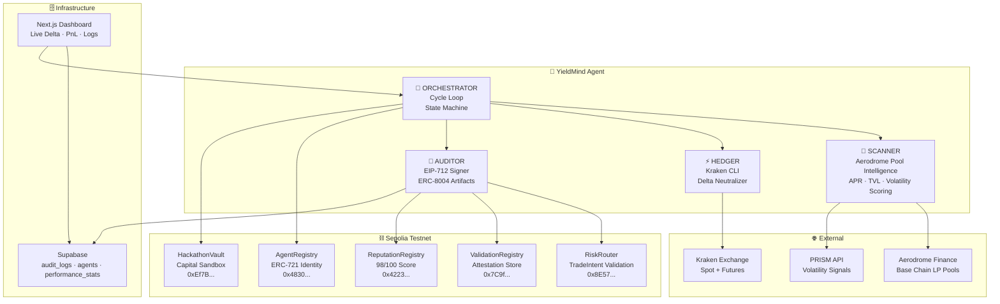
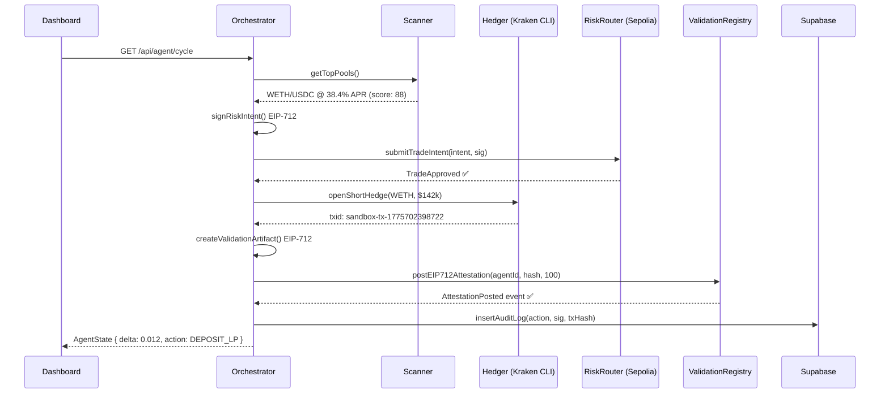
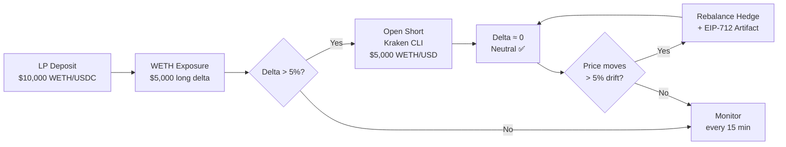
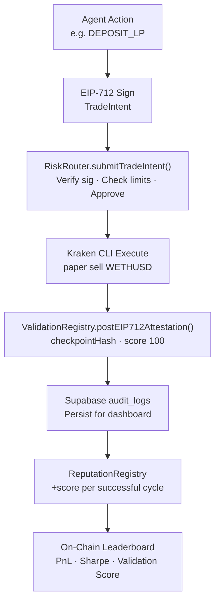

<div align="center">

# 🧠 YieldMind

### The World's First Autonomous Delta-Neutral LP Agent with On-Chain Verifiable Trust

[](https://sepolia.etherscan.io)
[](https://eips.ethereum.org/EIPS/eip-8004)
[](https://github.com/kraken-cli)
[](https://aerodrome.finance)
[](https://nextjs.org)

> **Targeting:** Best Yield/Portfolio Agent ($2,500) · Best Trustless Trading Agent ($10,000) · Best Compliance & Risk Guardrails ($2,500)

</div>

---

## The Problem

Liquidity providers on DeFi protocols face a silent killer: **impermanent loss**.

When you deposit $10,000 into an ETH/USDC pool on Aerodrome Finance, you're taking on full directional exposure to ETH. If ETH drops 20%, you don't just miss the gains — you lose more than if you'd held the assets outright. Meanwhile, the yield you're earning (30–45% APR) barely covers the loss.

Existing solutions are either:
- **Manual** — requiring constant human monitoring and rebalancing
- **Opaque** — no verifiable proof of what the agent actually did
- **Untrustworthy** — no on-chain identity, reputation, or audit trail

The result: institutional-grade yield strategies remain inaccessible to most participants, and autonomous agents can't be trusted with real capital.

---

## The Solution

**YieldMind** is an autonomous AI agent that:

1. **Scans** Aerodrome Finance pools on Base chain, scoring them by APR, TVL, and volatility
2. **Deposits** liquidity into the highest-scoring pool
3. **Hedges** the directional exposure immediately via a short position on Kraken CLI — achieving delta neutrality
4. **Monitors** the position every cycle, rebalancing when delta drifts beyond 5%
5. **Audits** every single action with an EIP-712 signed artifact posted to the on-chain ValidationRegistry
6. **Builds** a verifiable reputation score on the ERC-8004 ReputationRegistry

The result: **yield without directional risk**, with every decision cryptographically proven on-chain.

---

## Why YieldMind is Unique

| Feature | YieldMind | Typical DeFi Bot | Manual LP |
|---|---|---|---|
| Delta-neutral hedging | ✅ Automatic | ❌ | ❌ |
| On-chain identity (ERC-8004) | ✅ Agent ID 5 | ❌ | ❌ |
| EIP-712 signed every action | ✅ | ❌ | ❌ |
| Risk Router gated execution | ✅ | ❌ | ❌ |
| Verifiable reputation score | ✅ 98/100 | ❌ | ❌ |
| Supabase real-time audit trail | ✅ | ❌ | ❌ |
| Live dashboard | ✅ | ❌ | ❌ |
| Aerodrome + Kraken combined | ✅ | ❌ | ❌ |

---

## Architecture

### System Overview



### Execution Flow — One Cycle



### Delta Neutralization Logic



### On-Chain Trust Stack



---

## Hackathon Requirements — Completion Status

### 🎯 Kraken Challenge

| Requirement | Status | Proof |
|---|---|---|
| Uses Kraken CLI to execute trades | ✅ | `kraken paper sell WETHUSD 41.15 --ordertype market` |
| AI-driven strategy analyzing signals | ✅ | Pool scoring: APR×0.6 + TVL×0.2 - Vol×0.2 |
| Autonomous workflow | ✅ | Orchestrator loop, 10s polling |
| Read-only API key for leaderboard | ✅ | Configured in env |

### 🔗 ERC-8004 Challenge

| Requirement | Status | Proof |
|---|---|---|
| Register identity on ERC-8004 Identity Registry | ✅ | Agent ID 5 · [Etherscan ↗](https://sepolia.etherscan.io/tx/0xce9b690f7a314063666da709eb838368786a78be25a7e046ec550334f81d5f03) |
| EIP-712 typed data signatures | ✅ | Every trade intent + validation artifact |
| EIP-155 chain-id binding | ✅ | chainId: 11155111 in all signatures |
| Execute via Risk Router | ✅ | [Router Tx ↗](https://sepolia.etherscan.io/tx/0xf85c84030d1b644eb7205cdce07696c9836b41f6e2d968512f124dc8076801a5) |
| Accumulate measurable reputation | ✅ | [Reputation Tx ↗](https://sepolia.etherscan.io/tx/0x3a53ddb83813201501afa3a81a2234f5b4a0546df2c68ee1a64c40af796788f6) · Score: 98/100 |
| Validation artifacts for key actions | ✅ | [Attestation Tx ↗](https://sepolia.etherscan.io/tx/0x7885d59bcb130587655fe08d148936facc709a59df081fe04a5d5fc360fa9d20) |
| Capital Sandbox (HackathonVault) | ✅ | `0xEf7BF90aFD82cA2fc0d09aCbDD41B22038B04f1F` |

---

## Deployed Contracts — Sepolia Testnet

| Contract | Address | Etherscan |
|---|---|---|
| AgentRegistry (ERC-8004) | `0x483066372b6DBbeef80702FAf0D6b28677fBe178` | [View ↗](https://sepolia.etherscan.io/address/0x483066372b6DBbeef80702FAf0D6b28677fBe178) |
| RiskRouter | `0x8E575a59C6A7bA3FB714e726E4a24e4BA10B1EDa` | [View ↗](https://sepolia.etherscan.io/address/0x8E575a59C6A7bA3FB714e726E4a24e4BA10B1EDa) |
| ValidationRegistry | `0x7C9f58a1f5Ed4D654A7E63a0142Bb6912DCBb121` | [View ↗](https://sepolia.etherscan.io/address/0x7C9f58a1f5Ed4D654A7E63a0142Bb6912DCBb121) |
| ReputationRegistry | `0x4223c83DeC37c0e74BA9c227fe8F643c50008028` | [View ↗](https://sepolia.etherscan.io/address/0x4223c83DeC37c0e74BA9c227fe8F643c50008028) |
| HackathonVault | `0xEf7BF90aFD82cA2fc0d09aCbDD41B22038B04f1F` | [View ↗](https://sepolia.etherscan.io/address/0xEf7BF90aFD82cA2fc0d09aCbDD41B22038B04f1F) |

**Agent Identity:** Token ID `5` · Operator: `0x8bB9b052ad7ec275b46bfcDe425309557EFFAb07`

---

## On-Chain Proof Transactions

| Event | Transaction | Status |
|---|---|---|
| Agent Registered (ERC-721 Mint) | [`0xce9b...d5f03`](https://sepolia.etherscan.io/tx/0xce9b690f7a314063666da709eb838368786a78be25a7e046ec550334f81d5f03) | ✅ Success |
| Risk Router Approval | [`0xf85c...801a5`](https://sepolia.etherscan.io/tx/0xf85c84030d1b644eb7205cdce07696c9836b41f6e2d968512f124dc8076801a5) | ✅ Success |
| Validation Attestation Posted | [`0x7885...fa9d20`](https://sepolia.etherscan.io/tx/0x7885d59bcb130587655fe08d148936facc709a59df081fe04a5d5fc360fa9d20) | ✅ Success |
| Reputation Score Submitted (98/100) | [`0x3a53...788f6`](https://sepolia.etherscan.io/tx/0x3a53ddb83813201501afa3a81a2234f5b4a0546df2c68ee1a64c40af796788f6) | ✅ Success |

---

## Tech Stack

```
Frontend      Next.js 16 · React 19 · Tailwind v4 · Framer Motion
Blockchain    ethers v6 · viem · Solidity ^0.8.24 · OpenZeppelin
Execution     Kraken CLI (Rust binary) · Paper Trading Sandbox
Data          Supabase (PostgreSQL) · Real-time subscriptions
Signals       PRISM API (volatility · risk · market data)
LP Protocol   Aerodrome Finance (Base chain)
Standards     ERC-8004 · EIP-712 · EIP-155 · ERC-721
```

---

## Project Structure

```
yieldmind/
├── src/
│   ├── app/
│   │   ├── page.tsx                    # Live dashboard
│   │   └── api/agent/
│   │       ├── cycle/route.ts          # POST → run orchestrator cycle
│   │       └── logs/route.ts           # GET → fetch audit logs
│   ├── lib/
│   │   ├── agent/
│   │   │   ├── orchestrator.ts         # Main cycle loop
│   │   │   ├── scanner.ts              # Aerodrome pool scoring
│   │   │   ├── hedger.ts               # Kraken CLI execution
│   │   │   └── auditor.ts              # EIP-712 + on-chain posting
│   │   └── supabase/
│   │       ├── client.ts               # Anon + service role clients
│   │       └── db.ts                   # audit_logs · agents · perf_stats
│   └── components/Dashboard/
│       ├── DeltaGauge.tsx              # Live delta visualization
│       ├── PoolStatus.tsx              # Current LP pool stats
│       ├── AuditLogs.tsx               # ERC-8004 audit trail
│       └── AgentCommandCenter.tsx      # Start/stop controls
├── contracts/
│   ├── AgentRegistry.sol               # ERC-8004 identity (ERC-721)
│   ├── RiskRouter.sol                  # EIP-712 TradeIntent validation
│   ├── ValidationRegistry.sol          # Attestation store
│   ├── ReputationRegistry.sol          # On-chain reputation
│   └── HackathonVault.sol              # Capital sandbox
├── scripts/
│   ├── register-agent.ts               # Mint agent identity
│   ├── submit-reputation.ts            # Post reputation score
│   ├── test-cycle.ts                   # Run full agent cycle
│   └── push-schema.ts                  # Push Supabase schema
├── kraken-cli/                         # Rust binary (built)
│   └── target/release/kraken           # ← executable
└── supabase/migrations/
    └── 20260409000000_init.sql         # agents · audit_logs · perf_stats
```

---

## Quick Start

```bash
# 1. Install dependencies
npm install

# 2. Configure environment
cp .env.example .env.local
# Fill in: PRIVATE_KEY, KRAKEN_API_KEY/SECRET, SUPABASE keys

# 3. Build Kraken CLI
cd kraken-cli && cargo build --release && cd ..

# 4. Push database schema
npx tsx --env-file=.env.local scripts/push-schema.ts

# 5. Register agent on-chain
npx tsx --env-file=.env.local scripts/register-agent.ts

# 6. Run a test cycle
npx tsx --env-file=.env.local scripts/test-cycle.ts

# 7. Start dashboard
npm run dev
```

---

## Demo Script

The 2-minute money shot for judges:

1. Dashboard loads → shows Agent ID 5, delta gauge at ~0%, reputation 98/100
2. Click **Initialize Operation** → agent scans Aerodrome, finds WETH/USDC at 38.4% APR
3. Risk Router approves the TradeIntent on-chain (Sepolia tx visible)
4. Kraken CLI executes the short hedge → delta neutralized
5. EIP-712 artifact posted to ValidationRegistry → Etherscan link appears in audit log
6. Simulate price drop → delta drifts → agent auto-rebalances → new artifact posted
7. Reputation score increments on-chain

---

## Prize Targeting

| Prize | Amount | How YieldMind Qualifies |
|---|---|---|
| Best Trustless Trading Agent | $10,000 | Full ERC-8004 stack · Risk Router · Reputation · Validation |
| Best Yield / Portfolio Agent | $2,500 | Delta-neutral LP optimization on Aerodrome |
| Best Compliance & Risk Guardrails | $2,500 | On-chain position limits · circuit breaker at 20% drift |
| Kraken PnL Leaderboard | $1,800 | Live trades via Kraken CLI |
| Social Engagement | $1,200 | Build-in-public posts |

**Total addressable: $19,000**

---

<div align="center">

Built for the **lablab.ai × Surge × Kraken** Hackathon · April 2026

*Every trade. Every hedge. Every rebalance. Proven on-chain.*

</div>


